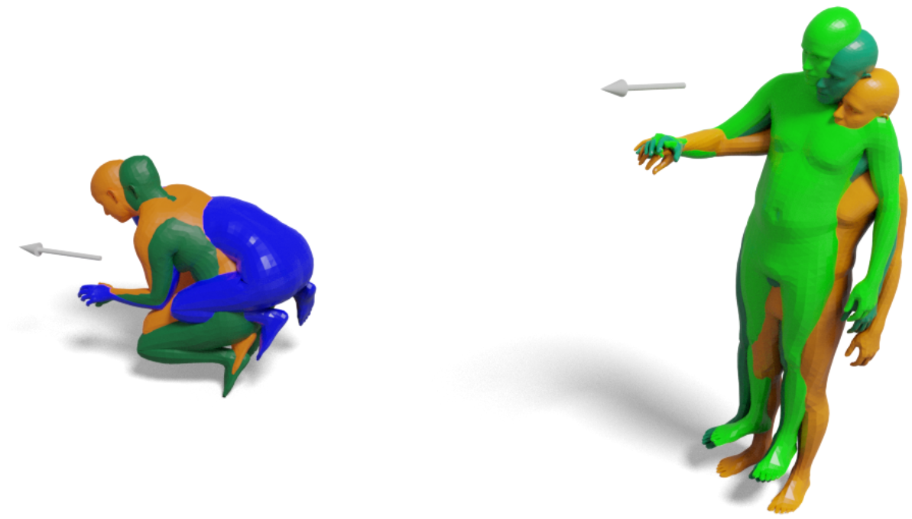

# CGrasp
This repository is the official implementation of the CReach model from 
our __3DV 2025__ paper:

**3D Whole-body Grasp Synthesis with Directional Controllability**
(https://gpaschalidis.github.io/cwgrasp/).

<a href="">

</a>

<p align="justify">
CReach is a generative model for reaching body generation, conditioned on a given arm direction and the desired wrist location of 
either the right or the left hand. 
</p>

## Installation & Dependencies
Clone the repository using:

```bash
git clone git@github.com:gpaschalidis/creach.git
cd creach
```
Run the following commands:
```bash
conda create -n creach python=3.9 -y
conda activate creach
conda install pytorch=2.0.1 torchvision torchaudio pytorch-cuda=11.7 -c pytorch -c nvidia
pip install "git+https://github.com/facebookresearch/pytorch3d.git@stable"
pip install git+https://github.com/otaheri/chamfer_distance.git
pip install git+https://github.com/otaheri/bps_torch.git
```
```bash
pip install -r requirements.txt
 ```
## Getting started

We have trained CReach using both GRAB nad CIRCLE datasets.

- Download the GRAB dataset from the [GRAB website](https://grab.is.tue.mpg.de), and follow the instructions there to extract the files.

Downoad the CIRCLE dataset from [here](https://circledataset.s3.us-west-2.amazonaws.com/release/CIRCLE_movement.zip) and unzip the file.

Put both datasets in the the folder "datasets", following the structure below:

```bash
    datasets
    ├── GRAB
    │    └──  grab
    │          └── s1    
    │          └── ...    
    │          └── s10    
    │            
    └── CIRCLE_movement
         └── s1  
         └── ... 
         └── s7_left 

```

#### SMPLX models
- Download body models following the steps on the [SMPLX repo](https://github.com/vchoutas/smplx) and put it in the folder "smplx_models"
- Run the following command to merge GRAB and CIRCLE into a single dataset.

```bash
 python process_grab_circle_data.py --grab_path datasets/GRAB/grab/ --circle_path datasets/CIRCLE_movement --save_path datasets/grab_circle_dataset --smplx_path smplx_models/

```
To annotate the grasping arm to left or right and create a dataset with the same right amount of right and left arm reaching bodies we 
use the following two scripts. With the first we detect the left arm reaching bodies and transforming them into right arm, by creating 
an only right arm body reaching dataset 

```bash
 python process_body_data.py --dataset_path datasets/grab_circle_dataset --smplx_path smplx_models/ --save_dir datasets/grab_circle_only_rh
```

Finally, we use the following script to create a left arm reaching body dataset, by mirrotig the previous one. By merging these two 
datasets we obtain the final dataset, with which we train our CReach.
the seccond script we mirror

```bash
 python mirror_body_data.py --dataset_path datasets/grab_circle_only_rh --smplx_path smplx_models/ --save_dir datasets/creach_dataset
```

## Train CReach
To train CReach from scratch use the following command:

```bash
python train/train_creach.py --work-dir $working_directory  --grab-circle-path datasets/creach_dataset --smplx-path smplx_models/
```

## Test CReach
To try CReach you need as inputs an arm direction and a wrist location. 

- Download first the ReplicaGrasp dataset from [FLEX github page](https://github.com/purvaten/FLEX), and place it in the folder
"datasets". 
- Inside the GRAB folder you can find the GRAB object mesh (`.ply`) files.

```bash
    datasets
    ├── GRAB
    │    └──  grab
    │          └── s1    
    │          └── ...    
    │          └── s10    
    │    └──  grab
    │          └── s1    
    │            
    │            
    ├── replicagrasp
    │        ├── dset_info.npz
    │        └── receptacles.npz
    │            
    │            
    .
    .
    .
```
To obtain plausible reaching directions for each configuration of replicagrasp we use the ReachingField model,
which you can install it using:

```bash
 python process_grab_circle_data.py --grab_path datasets/GRAB/grab/ --circle_path datasets/CIRCLE_movement --save_path datasets/creach_dataset --smplx_path smplx_models/
```
The file "dset_info.npz" contains many configurations which you can use to test CReach, by using the following command:

```bash
 python process_grab_circle_data.py --grab_path datasets/GRAB/grab/ --circle_path datasets/CIRCLE_movement --save_path datasets/creach_dataset --smplx_path smplx_models/
```


## Citation
If you found this work influential or helpful for your research, please cite:
```
@inproceedings{paschalidis2025cwgrasp,
  title     = {{3D} {W}hole-Body Grasp Synthesis with Directional Controllability},
  author    = {Paschalidis, Georgios and Wilschut, Romana and Anti\'{c}, Dimitrije and Taheri, Omid and Tzionas, Dimitrios},
  booktitle = {{International Conference on 3D Vision (3DV)}},
  year      = {2025}
 }
```
